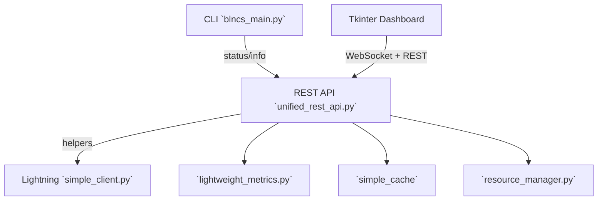

# BLNCS System Architecture

## Overview
Bitcoin Lightning Network Control System (BLNCS) provides lightweight tooling for monitoring Lightning infrastructure, orchestrating tasks, and exposing REST/CLI/GUI control surfaces. The architecture favors pragmatic modules housed in `blncs/core/`, optional Lightning helpers in `blncs/lightning/`, and a Flask-based API in `blncs/api/unified_rest_api.py`.

## Core Architecture Principles

### Design Priorities
- **Simple Defaults**: Minimal dependencies, JSON configuration (`config/blncs.json`), and lazy imports (`blncs/core/fast_startup.py`).
- **Practical Reliability**: Cooperative resource cleanup via `blncs/core/resource_manager.py` and guarded optimizers (`PerformanceOptimizer`).
- **Operator Visibility**: Lightweight metrics in `blncs/core/lightweight_metrics.py` and status endpoints served from `blncs/api/unified_rest_api.py`.
- **Extensibility**: Optional GUI (`blncs/gui/dashboard_gui.py`) and Lightning clients (`blncs/lightning/simple_client.py`).

### Consolidated System Layers

#### 1. Core Layer (`blncs/core/`)
**Purpose**: Shared foundations (logging, caching, metrics, resources) optimized for low overhead.

**Representative Modules**:
- `logger.py` – Buffered console logger with memory-friendly ring buffer.
- `fast_startup.py` – `FastStartup` and `PerformanceOptimizer` classes for lazy imports and bounded GC/IO tuning.
- `lightweight_metrics.py` – `SystemMetricsCollector` using `psutil` (when available) and `gc.get_count()` for micro-overhead stats.
- `resource_manager.py` – Cooperative shutdown orchestration across threads, connections, and registered handlers.
- `rate_limiter.py` – Adaptive request throttling supporting API/CLI protections.
- `simple_auth.py` – Minimal token-based authentication helpers.

#### 2. Lightning Layer (`blncs/lightning/`)
**Purpose**: Optional Lightning integration for test and production nodes.

**Key Modules**:
- `simple_client.py` – Mock-friendly client with configurable backends.
- `invoice_manager.py`, `channel_manager.py` – High-level helpers for invoices and channels (lightweight wrappers).
- `routing_manager.py` – Simplified path evaluation for routing demonstrations.

#### 3. API Layer (`blncs/api/`)
**Purpose**: REST endpoints and WebSocket notifications for operators.

**Key Module**:
- `unified_rest_api.py` – Flask application offering `/health`, `/api/info`, cache/config helpers, Lightning operations, and system tools such as `/api/system/optimize`.
- `websocket_server.py` – Optional WebSocket broadcaster used by the GUI dashboard.

#### 4. CLI (`blncs_main.py`)
**Purpose**: Single entry point for configuration templating, status checks, Lightning helpers, and maintenance commands.

**Highlights**:
- `create_config_template()` seeds `config/blncs.json` with sensible defaults.
- `init_system()` initializes a shared `SimpleConfig`, logger, and error handler caches.
- Subcommands provide status, info, backup, invoice, and decode tooling.

#### 5. GUI Layer (`blncs/gui/`)
**Purpose**: Optional Tkinter dashboard for operators preferring a native interface.

**Key Modules**:
- `dashboard_gui.py` – Dashboard logic with jittered WebSocket reconnects and configurable REST polling intervals.
- `net_utils.py` – Proxy-aware WebSocket URL builder and HTTP session factory with per-session timeout controls.

### Data Flow

## Security Considerations

- **Input validation**: REST endpoints validate required fields and types before invoking Lightning operations.
- **Rate limiting**: `blncs/core/rate_limiter.py` helps throttle abuse-prone commands.
- **Credential handling**: Lightning client configuration reads macaroon/cert paths without bundling secrets in code.
- **Optional TLS**: Deployment guidance shows how to place BLNCS behind TLS terminators or reverse proxies.

## Performance & Observability

- **Caching**: `cache_response()` decorator in `blncs/api/unified_rest_api.py` maintains a bounded in-memory cache for idempotent GET responses.
- **Startup profiling**: `FastStartup.get_startup_stats()` surfaces timing data to spot heavyweight imports.
- **Metrics**: `SystemMetricsCollector` reports CPU, memory, disk, network, and GC metrics; `/api/system/metrics` returns the same payload for remote dashboards.
- **Resource insight**: `ResourceManager.get_resource_stats()` summarizes tracked threads, connections, and subscriptions so operators can detect leaks.

## Reliability & Maintenance

- **Health checks**: `/health` reports database, cache, and Lightning connectivity with HTTP 503 signaling degradations.
- **Backups**: `simple_backup_recovery.AutoBackup` performs periodic backups with cooperative shutdown via `threading.Event`, ensuring stop requests are processed quickly.
- **Shutdown orchestration**: `resource_manager.shutdown_all()` cleans up registered resources and custom handlers in order.
- **Error handling**: REST endpoints wrap Lightning calls in `try` blocks, returning JSON error payloads instead of stack traces.

## Configuration

- **Primary source**: `config/blncs.json`, generated by `blncs_main.py config --template`, drives the CLI and server defaults.
- **Reloading**: `SimpleConfig.reload()` permits manual refresh without process restarts.
- **Environment overlays**: `blncs.config.ConfigurationManager` merges YAML files (`default.yaml`, `{BLNCS_ENVIRONMENT}.yaml`, `local.yaml`) for the runtime API server.

## Deployment

- **Local virtualenv**: See Option A in `docs/DEPLOYMENT_GUIDE_UNIFIED.md` for developer installs.
- **systemd**: Option B describes a production-style `/etc/systemd/system/blncs.service` launching `blncs_main.py server` under a dedicated user.
- **Docker Compose**: Option C packages the REST API and optional dependencies inside containers for reproducible environments.
- **Dependencies**: Python 3.10+ plus optional extras (`Flask`, `psutil`, Lightning client libraries) depending on enabled subsystems.

## Development Notes

- **Structure**: Modules live under domain directories (`blncs/core/`, `blncs/api/`, `blncs/lightning/`, `blncs/gui/`, `blncs/utils/`).
- **Testing**: Suites such as `tests/unit/test_dashboard_gui.py`, `tests/unit/test_net_utils.py`, and `tests/test_unified_comprehensive.py` cover GUI networking, proxy handling, and REST contract behavior.
- **Extensibility**: Adding endpoints or CLI commands typically involves a single module update thanks to helper factories and decorators.

## Future Considerations

- **Lightning adapters**: Additional client backends (e.g., gRPC) can be slotted into `blncs/lightning/` without restructuring core modules.
- **GUI tooling**: Continue expanding diagnostics and proxy controls surfaced via `blncs_gui.py` flags documented in `docs/GUI_NATIVE.md`.
- **Lightweight optimization**: Maintain focus on low-overhead instrumentation and removal of unused modules to keep deployments streamlined.

---

*This architecture summary reflects the maintained BLNCS codebase as of 2025-09-25, emphasizing practical, lightweight components.*